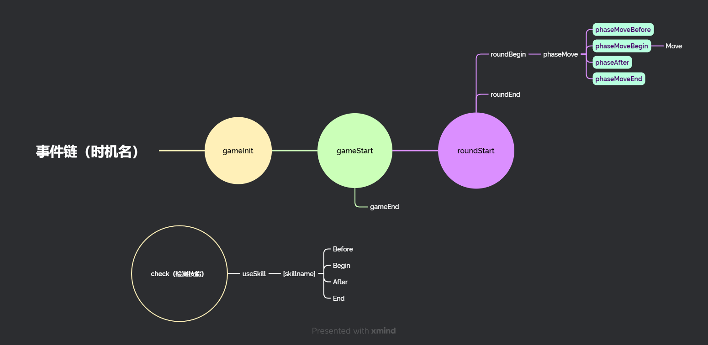

这个代码也是写了好久好久，就上传到github上留念一下，纪念自己的热血吧

具体事件流程请参考下图

使用流程：导入 api 里的 game 变量， init() 初始化以获得初始化结束的事件 event

使用 game.addCharacter 函数添加角色进入游戏，然后 event.start() 开始模拟， event.getResult() 获取排名: 名字的字典

代码编写的使用方法请参考 game.py文件的快速启动函数 faseStart

如果你想添加技能，请参考 skill.py 的初始化

在 game.importStandard 函数里有所有角色，名字后面带注释tested的即为测试过